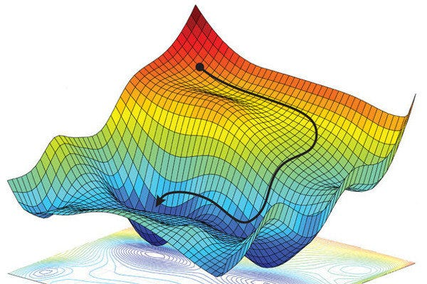

# Optimisation techniques

In the previous exercise, we were trying to optimise the cost function by finding values of m and c that produced the minimum cost over our training set.

There are infinite values for m and c, so how did you conclusively say that your result was optimal ?

How did you not spend hours and hours testing every possible combination of m and c ?

All these questions are very good ones and touch at the very heart of artificial intelligence : how can we find the best result in a search space that is infinitely large ? More importantly, how can we find the best result given limited resources (computing power, time) ?

* In a game of chess, at every move, a computer could theoretically calculate every possible move starting from the current state of the board, resulting in a win. This however, could take a very long time, even with our most recent technology.
* When calculating your route, your GPS must enumerate every possible route, and pick the shortest one. But if your GPS were to calculate every side road, every detour, every circle-back, it would potentially never find a result
* When estimating car/house/... prices, we could calculate every possible value of the coefficients for our selected estimation function, but this may take forever !

Thus the problem becomes : how can I navigate the search space in such a way as to head towards an optimal solution ?

In our example, the search space is a two dimensional space (m and c), that results in a 3 dimensional surface (the 3rd dimension is the cost that we calculate for our set of samples).

<figure><figcaption>
<a href="https://inspiredink.medium.com/calculus-for-machine-learning-924f99c9994b">Source</a>
</figcaption></figure>

Optimisation is a large field, and there are a number of interesting and novel techniques for locating a minimum:&#x20;

* **space partitioning** : to start with perhaps divide the space up into smaller subspaces and calculate a small sample in each subspace. Recursively dive into the spaces that give us the best results
* **heuristics :** algorithms like A\* (for pathfinding) will not try to enumerate every possible route to a destination, but at each step use a human-provided value to decide which direction to go that will bring it close to the final destination (for example, distance as the bird flies from the current position to the final position).
* **plain old calculus** : if the cost function forms a continuous curve, we can simply follow the gradient of the curve to its lowest point. And as luck has it, this is the case for our house price example. We will analyse this option in the next chapter.

The problem with optimisation is that sometime we can fall into a trap ! We may find ourselves in a **local minimum**, where every path out of it increases the cost again. Our algorithm may decide, not knowing any better, that it has found the most optimal solution, but it really had not.

For unknown cost functions, there is no real way of ensuring we have found a global minimum. There are however algorithms that allow use to "jump" out of local minima allowing us to get back on track towards the global minimum :

* **genetic algorithms :** consider that our set of coefficients `{m,c}` are like a DNA strand that evolves and improves over time. At each step of our optimisation, we try find the optimal path towards a minimal cost. However, at each step we can randomly **mutate** zero or more of the coefficients. This will have the effect of introducing randomness into our path, and could push us out of potential local minima.
* **simulated annealing :** another technique for finding the global minimum&#x20;

> At each step, the simulated annealing heuristic considers some neighboring state _s\*_ of the current state _s_, and [probabilistically](https://en.wikipedia.org/wiki/Probabilistic) decides between moving the system to state _s\*_ or staying in-state _s_. These probabilities ultimately lead the system to move to states of lower energy. Typically this step is repeated until the system reaches a state that is good enough for the application, or until a given computation budget has been exhausted.
>
> ([https://en.wikipedia.org/wiki/Simulated\_annealing](https://en.wikipedia.org/wiki/Simulated\_annealing))

For our housing example, it turns our that our cost function is actually a n-dimensional paraboloid, that always has a global minimum. All we have to do is follow the steepest curve downwards until we find the minimum cost.&#x20;

